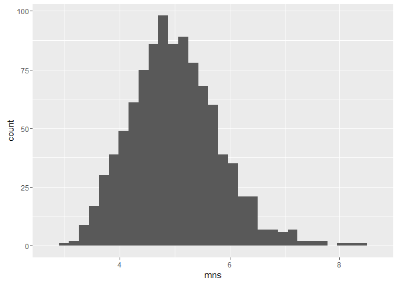

# Statistical Inference Assignment: Part 1
Michael Crocco  


## Overview
This report will compare the exponential distribution to the Central Limit Theorem.
Using a randomly generated exponential distribution, sample mean and standard deviation will be contrasted with those expected from the CLS.

## Generate Distribution
First, we need to set variables and generate some numbers.

```r
lambda <- 0.2 # rate parameter in exponential distribution
n = 40 #number of exponentials
mns = NULL
for (i in 1 : 1000) mns = c(mns, mean(rexp(n,lambda))) # take the mean of 1000 simulations
```
## Display the Distribution

```r
library(ggplot2)
qplot(mns) + geom_histogram()
```

```
## `stat_bin()` using `bins = 30`. Pick better value with `binwidth`.
## `stat_bin()` using `bins = 30`. Pick better value with `binwidth`.
```


#It worked!

##Next, overlay the theoretical and sample means

```r
SampleMean <- mean(mns)
CLTMean <- 1/lambda
```
